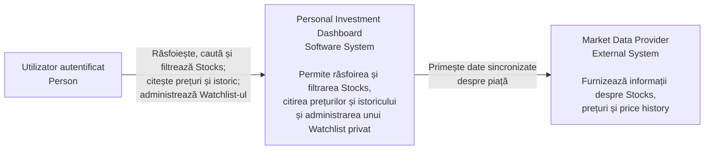
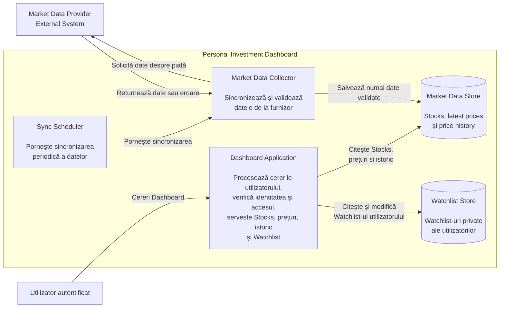
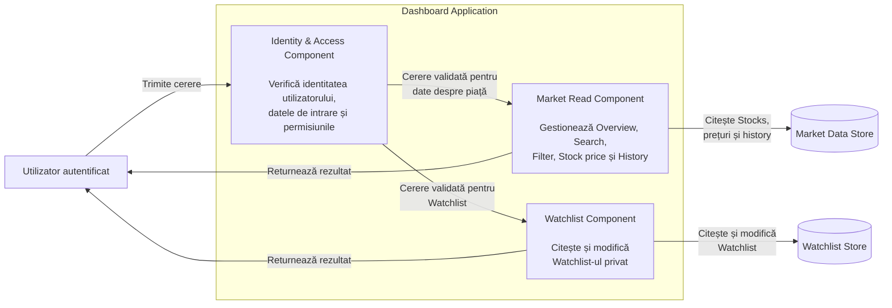
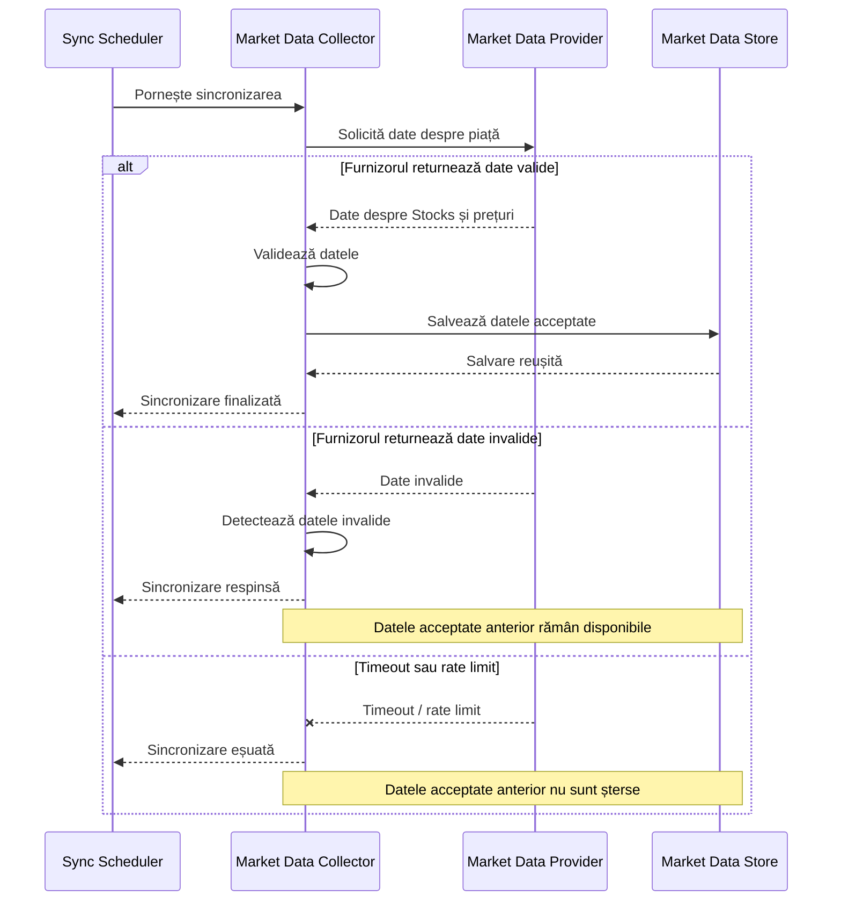
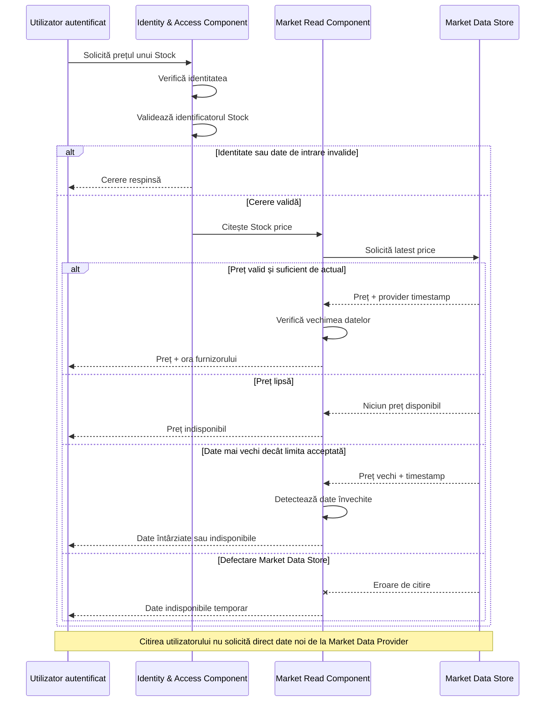
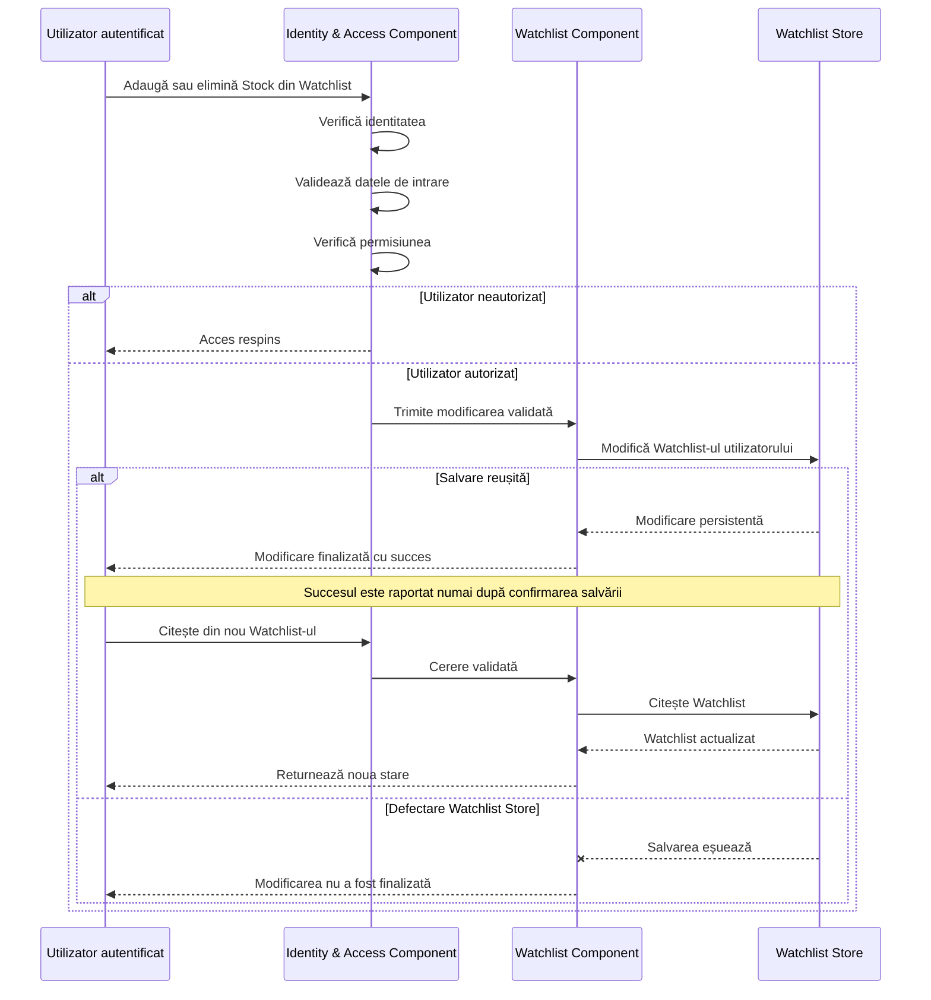

# Laboratorul 3 – Desenează limita Dashboard-ului

## Scop

Scopul laboratorului este proiectarea limitelor și structurii unui **Personal Investment Dashboard** folosind diagrame Mermaid.

Dashboard-ul permite unui utilizator autentificat să:

- răsfoiască Stocks;
- filtreze Stocks;
- caute Stocks;
- citească prețuri;
- citească price history;
- administreze un Watchlist privat.

Sistemul extern **Market Data Provider** furnizează date despre piață, dar poate:

- returna date invalide;
- limita numărul de cereri;
- deveni temporar indisponibil.

Proiectarea trebuie să respecte volumul de lucru analizat în Laboratorul 2.

---

# 1. Diagrama System Context

Diagrama System Context prezintă sistemul ca un întreg și relațiile sale cu actorul uman și sistemul extern.

Nu sunt prezentate componentele interne ale Dashboard-ului.



## Explicație

**Utilizatorul autentificat** este actorul uman direct al sistemului.

**Personal Investment Dashboard** este sistemul analizat.

**Market Data Provider** este sistemul extern care furnizează datele despre piață.

Dashboard-ul trebuie să gestioneze situațiile în care furnizorul:

- returnează date invalide;
- limitează cererile;
- nu răspunde;
- furnizează date întârziate.

---

# 2. Diagrama Container

Diagrama Container deschide limita sistemului și prezintă principalele părți de execuție și stocările necesare.



## Responsabilități

### Dashboard Application

Este responsabilă pentru:

- validarea cererilor utilizatorului;
- verificarea identității;
- verificarea drepturilor de acces;
- Search;
- Filter;
- Overview;
- Stock price;
- History;
- Watchlist.

### Market Data Collector

Este responsabil pentru:

- comunicarea cu Market Data Provider;
- validarea datelor primite;
- respingerea datelor invalide;
- păstrarea ultimelor date acceptate atunci când o sincronizare eșuează;
- salvarea datelor valide în Market Data Store.

Datele de autentificare pentru Market Data Provider sunt păstrate pe server și nu sunt expuse utilizatorului.

### Sync Scheduler

Pornește periodic procesul de sincronizare.

### Market Data Store

Păstrează:

- informații despre Stocks;
- latest prices;
- provider timestamp;
- price history.

### Watchlist Store

Păstrează Watchlist-urile private ale utilizatorilor.

---

# 3. Diagrama Component

Diagrama Component deschide numai containerul **Dashboard Application**.



## Componente

### Identity & Access Component

Responsabil pentru:

- identificarea utilizatorului autentificat;
- validarea datelor de intrare;
- verificarea permisiunilor;
- respingerea accesului neautorizat.

### Market Read Component

Responsabil pentru:

- Overview;
- Search;
- Filter;
- Stock price;
- price history;
- verificarea vechimii datelor înainte de prezentare.

### Watchlist Component

Responsabil pentru:

- citirea Watchlist-ului;
- adăugarea unui Stock;
- eliminarea unui Stock;
- verificarea faptului că utilizatorul modifică doar propriul Watchlist.

---

# 4. Diagrame de secvență

## A. Sincronizează datele de piață

Această diagramă prezintă sincronizarea datelor de la Market Data Provider.



### Ipoteze

- Sincronizarea este inițiată periodic de **Sync Scheduler**.
- Datele de autentificare pentru Market Data Provider sunt păstrate pe server.
- Datele sunt validate înainte de salvare.
- Datele invalide nu înlocuiesc datele valide existente.
- Dacă furnizorul nu răspunde sau limitează cererile, ultima versiune acceptată a datelor rămâne disponibilă.
- Dashboard-ul trebuie să poată marca aceste date ca întârziate dacă depășesc limita acceptată.

---

## B. Citește prețul unui Stock

Această diagramă prezintă citirea prețului unui Stock de către utilizator.



### Ipoteze

- Utilizatorul trebuie să fie autentificat.
- Identificatorul Stock este validat înainte de citirea datelor.
- Citirea utilizatorului este servită din **Market Data Store**.
- Citirea unui Stock de către utilizator nu generează o cerere nouă către Market Data Provider.
- Sincronizarea cu furnizorul este realizată separat de Market Data Collector.
- Un preț lipsă este prezentat ca **indisponibil**, nu ca `0`.
- Dacă datele sunt mai vechi decât limita acceptată, utilizatorul este informat.

---

## C. Modifică un Watchlist privat

Această diagramă prezintă modificarea Watchlist-ului privat al utilizatorului.



### Ipoteze

- Fiecare Watchlist aparține unui singur utilizator.
- Utilizatorul poate modifica numai propriul Watchlist.
- Identitatea, datele de intrare și permisiunea sunt verificate înainte de modificare.
- Succesul este raportat numai după ce Watchlist Store confirmă salvarea.
- Dacă salvarea eșuează, sistemul nu raportează operația ca reușită.
- După o modificare reușită, următoarea citire făcută de același utilizator trebuie să afișeze noua stare a Watchlist-ului.

---

# Relația cu Laboratorul 2

Proiectarea din acest laborator trebuie să poată susține volumul de lucru calculat anterior.

Pentru nivelul maxim analizat în Laboratorul 2:

```text
30.000 utilizatori concurenți
```

Traficul estimat în regim stabil a fost:

```text
7.920 RPS
```

iar ținta calculată pentru deschiderea pieței, inclusiv marja de capacitate, a fost:

```text
10.296 RPS
```

Aceste valori reprezintă ținte de proiectare și testare, nu demonstrează singure existența unui blocaj.

---

# Concluzie

În cadrul Laboratorului 3 a fost definită arhitectura Personal Investment Dashboard la trei niveluri.

**System Context** prezintă relația dintre utilizator, Dashboard și Market Data Provider.

**Container Diagram** separă responsabilitățile principale între Dashboard Application, Market Data Collector, Sync Scheduler și stocările de date.

**Component Diagram** detaliază Dashboard Application prin componente pentru identitate și acces, citirile datelor despre piață și gestionarea Watchlist-ului.

Cele trei diagrame de secvență verifică proiectarea pentru:

1. sincronizarea datelor de piață;
2. citirea prețului unui Stock;
3. modificarea unui Watchlist privat.

Fluxurile includ atât cazurile normale, cât și date invalide, indisponibilitatea furnizorului, date învechite, acces neautorizat și defectări ale stocării.